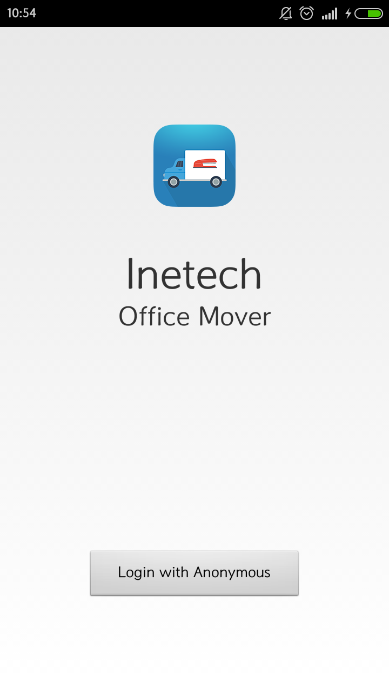

# demo-android-officemover
demo-android-officemover 是一个基于 Wilddog Android SDK 开发的关于室内设计应用，您可以在线通过拖拽控件，就可以多终端实时布局你的室内设计。



### 本地运行

0. 首先确认本机已经安装 [Android](http://developer.android.com/index.html) 和 [Andriod Studio](https://developer.android.com/sdk/installing/studio.html) 开发环境。
0. 执行下列指令：
```
git clone git@github.com:WildDogTeam/demo-android-officemover.git
cd  demo-android-officemover
```
0. 打开 `app/src/main/java/com/wilddog/officemover/OfficeMoverActivity.java`， 把 `<appId>` 换成你的应用URL。

### 注册 Wilddog

officemover 需要 Wilddog 来同步和存储数据。您可以在这里[注册](https://www.wilddog.com/my-account/signup)一个免费帐户。

### 更多示例

这里分类汇总了 WildDog平台上的示例程序和开源应用，　链接地址：[https://github.com/WildDogTeam/wilddog-demos](https://github.com/WildDogTeam/wilddog-demos)

### 支持
如果在使用过程中有任何问题，请提 [issue](https://github.com/WildDogTeam/demo-android-officemover/issues) ，我会在 Github 上给予帮助。

### 相关文档

* [Wilddog 概览](https://z.wilddog.com/overview/introduction)
* [Android SDK快速入门](https://z.wilddog.com/android/quickstart)
* [Android SDK API](https://z.wilddog.com/android/api)
* [下载页面](https://www.wilddog.com/download/)
* [Wilddog FAQ](https://z.wilddog.com/questions)

### License
MIT
http://wilddog.mit-license.org/

### 感谢 Thanks

demo-android-officemover is built on and with the aid of several  projects. We would like to thank the following projects for helping us achieve our goals:

Open Source:

* [OfficeMoverDemo](https://github.com/firebase/office-mover-5000/tree/master/android) Login powered by Firebase